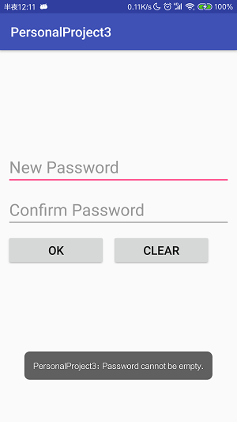

# 中山大学数据科学与计算机学院本科生实验报告

## （2018年秋季学期）

| 课程名称 | 手机平台应用开发 | 任课老师 | 郑贵锋 |
| :------------: | :-------------: | :------------: | :-------------: |
| 年级 | 2016级  | 专业（方向） |  计算机应用 |
| 学号 | 16340030 | 姓名 | 陈斯敏 |
| 电话 | 15917173057 | Email | 2540740154@qq.com |
| 开始日期 | 2018.11.4 | 完成日期 | 2018.11.5

---

## 一、实验题目

### **个人项目3**

### **数据存储应用开发**

#### 第九周任务: **数据存储（一）**

---

## 二、实验目的

### 1. 学习SharedPreference的基本使用。
### 2. 学习Android中常见的文件操作方法。
### 3. 复习Android界面编程。

---

## 三、实现内容

### 实验内容
#### 要求  
* Figure 1：首次进入，呈现创建密码界面。  
 
* Figure 2：若密码不匹配，弹出Toast提示。  
  
* Figure 3：若密码为空，弹出Toast提示。  
  
* Figure 4：退出后第二次进入呈现输入密码界面。  
  
* Figure 5：若密码不正确，弹出Toast提示。  
 
* Figure 6：文件加载失败，弹出Toast提示。  
  
* Figure 7：成功保存文件，弹出Toast提示。  
  
* Figure 8：成功导入文件，弹出Toast提示。  
  
###
1.  如Figure 1至Figure 8所示，本次实验演示应用包含两个Activity。 
2.  首先是密码输入Activity：
    * 若应用首次启动，则界面呈现出两个输入框，分别为新密码输入框和确认密码输入框。  
    * 输入框下方有两个按钮：  
        - OK按钮点击后：  
            + 若New Password为空，则发出Toast提示。见Figure 3。
            + 若New Password与Confirm Password不匹配，则发出Toast提示，见Figure 2。
            + 若两密码匹配，则保存此密码，并进入文件编辑Activity。
        - CLEAR按钮点击后：清楚两输入框的内容。  
    * 完成创建密码后，退出应用再进入应用，则只呈现一个密码输入框，见Figure 4。
        - 点击OK按钮后，若输入的密码与之前的密码不匹配，则弹出Toast提示，见Figure 5。
        - 点击CLEAR按钮后，清除密码输入框的内容。
    * **出于演示和学习的目的，本次实验我们使用SharedPreferences来保存密码。但实际应用中不会使用这种方式来存储敏感信息，而是采用更安全的机制。见[这里](http://stackoverflow.com/questions/1925486/android-storing-username-and-password)和[这里](http://stackoverflow.com/questions/785973/what-is-the-most-appropriate-way-to-store-user-settings-in-android-application/786588)。**
3.  文件编辑Activity：
    * 界面底部有三个按钮，高度一致，顶对齐，按钮水平均匀分布，三个按钮上方除ActionBar和StatusBar之外的全部空间由一个EditText占据（保留margin）。EditText内的文字竖直方向置顶，左对齐。
    * 在编辑区域输入任意内容，点击SAVE按钮后能保存到指定文件（文件名随意）。成功保存后，弹出Toast提示，见Figure 8。
    * 点击CLEAR按钮，能清空编辑区域的内容。
    * 点击LOAD按钮，能够从同一文件导入内容，并显示到编辑框中。若成功导入，则弹出Toast提示。见Figure 7.若读取文件过程中出现异常（如文件不存在），则弹出Toast提示。见Figure 6.
4.  特殊要求：进入文件编辑Activity后，若点击返回按钮，则直接返回Home界面，不再返回密码输入Activity。   

---

## 四、实验结果

### (1) 实验截图
* Figure 1：首次进入，呈现创建密码界面。  
 
* Figure 2：若密码不匹配，弹出Toast提示。  
  
* Figure 3：若密码为空，弹出Toast提示。  
  
* Figure 4：退出后第二次进入呈现输入密码界面。  
  
* Figure 5：若密码不正确，弹出Toast提示。  
 
* Figure 6：文件加载失败，弹出Toast提示。  
  
* Figure 7：成功保存文件，弹出Toast提示。  
  
* Figure 8：成功导入文件，弹出Toast提示。  
  

### (2) 实验步骤以及关键代码
* 实现主页面（登录界面）的页面布局文件 activity_main.xml，该页面由3个EditText和2个Button组成，我使用的是ConstraintLayout布局：
    ```xml
    <android.support.constraint.ConstraintLayout xmlns:android="http://schemas.android.com/apk/res/android"
    xmlns:app="http://schemas.android.com/apk/res-auto"
    xmlns:tools="http://schemas.android.com/tools"
    android:layout_width="match_parent"
    android:layout_height="match_parent"
    tools:context=".MainActivity">

        <EditText
            android:id="@+id/newPassword"
            android:layout_height="wrap_content"
            android:layout_width="match_parent"
            app:layout_constraintLeft_toLeftOf="parent"
            app:layout_constraintTop_toTopOf="parent"
            android:inputType="textPassword"
            android:hint="New Password"
            android:layout_marginTop="150dp"
            android:layout_marginLeft="10dp"
            android:layout_marginRight="10dp"
            android:textSize="25sp"/>

        <EditText
            android:id="@+id/Password"
            android:layout_height="wrap_content"
            android:layout_width="match_parent"
            app:layout_constraintTop_toBottomOf="@+id/newPassword"
            android:inputType="textPassword"
            android:hint="Password"
            android:visibility="invisible"
            android:layout_margin="10dp"
            android:textSize="25sp"/>

        <EditText
            android:id="@+id/confirmPassword"
            android:layout_height="wrap_content"
            android:layout_width="match_parent"
            app:layout_constraintTop_toBottomOf="@+id/newPassword"
            android:inputType="textPassword"
            android:hint="Confirm Password"
            android:layout_margin="10dp"
            android:textSize="25sp"/>

        <Button
            android:id="@+id/OK"
            android:onClick="OKButtonOnClick"
            android:layout_width="150dp"
            android:layout_height="wrap_content"
            app:layout_constraintTop_toBottomOf="@+id/confirmPassword"
            app:layout_constraintLeft_toLeftOf="parent"
            android:text="OK"
            android:layout_margin="10dp"
            android:padding= "10dp"
            android:textSize="18sp"/>

        <Button
            android:id="@+id/CLEAR"
            android:onClick="CLEARButtonOnClick"
            android:layout_width="150dp"
            android:layout_height="wrap_content"
            app:layout_constraintTop_toBottomOf="@+id/confirmPassword"
            app:layout_constraintLeft_toRightOf="@id/OK"
            android:text="CLEAR"
            android:layout_margin="10dp"
            android:padding="10dp"
            android:textSize="18sp"/>

    </android.support.constraint.ConstraintLayout>
    ```
* 在MainActivity.java中，在页面创建时，读取SharedPreferences中的password字段，如果读取不到内容，则说明是初次登录，则显示输入新密码和确认密码的EditText，否则，显示输入密码大的EditText。OnCreate函数如下：
    ```java
    //初始化存储密码，用以密码比对
    private String password;

    @Override
    protected void onCreate(Bundle savedInstanceState) {
        super.onCreate(savedInstanceState);
        setContentView(R.layout.activity_main);

        SharedPreferences sharedPref = this.getSharedPreferences("MY_PREFERENCE", Context.MODE_PRIVATE);
        password = sharedPref.getString("password", "");
        if(!password.equals("")) {
            findViewById(R.id.newPassword).setVisibility(View.INVISIBLE);
            findViewById(R.id.confirmPassword).setVisibility(View.INVISIBLE);
            findViewById(R.id.Password).setVisibility(View.VISIBLE);
        }
    }
    ```
* 然后是主页面CLEAR按钮的点击事件，这里将所有的EditText全部设置为空，简单粗暴无需判断：
    ```java
    public void CLEARButtonOnClick(View target) {
        ((EditText)findViewById(R.id.newPassword)).setText("");
        ((EditText)findViewById(R.id.confirmPassword)).setText("");
        ((EditText)findViewById(R.id.Password)).setText("");
    }
    ```
* 主页面的OK按钮的点击事件需要分情况，根据我们OnCreate函数保存的password值，可以断定当前是否已经存在密码，并作出不同事件处理，其他的事件判断处理均依照题目要求，比较简单：
    ```java
    public void OKButtonOnClick(View target) {
        if (password.equals("")) {
            // 为空说明不存在密码
            String newPassword = ((EditText)findViewById(R.id.newPassword)).getText().toString();
            String confirmPassword = ((EditText)findViewById(R.id.confirmPassword)).getText().toString();
            if (newPassword.length() == 0) {
                Toast.makeText(getApplication(),"Password cannot be empty.",Toast.LENGTH_SHORT).show();
            } else if (!newPassword.equals(confirmPassword)) {
                Toast.makeText(getApplication(),"Password Mismatch.",Toast.LENGTH_SHORT).show();
            } else {
                SharedPreferences sharedPref = this.getSharedPreferences("MY_PREFERENCE", Context.MODE_PRIVATE);
                SharedPreferences.Editor editor = sharedPref.edit();
                editor.putString("password", newPassword);
                editor.commit();
                // 跳转到编辑页面
                Intent intent = new Intent(MainActivity.this, FileEditorActivity.class);
                startActivity(intent);
            }
        } else {
            // 已经有了密码的情况
            String userPassword = ((EditText)findViewById(R.id.Password)).getText().toString();
            if (!userPassword.equals(password)) {
                Toast.makeText(getApplication(),"Invalid Password.",Toast.LENGTH_SHORT).show();
            } else {
                // 跳转到编辑页面
                Intent intent = new Intent(MainActivity.this, FileEditorActivity.class);
                startActivity(intent);
            }
        }
    }
    ```
* 然后是文件编辑页面的页面布局文件activity_file_editor.xml，这里我们需要一个编辑框和3个按钮，为了使按钮布局满足要求，我用一个RelativeLayout将这3个按钮包起来，如下所示：
    ```xml
    <LinearLayout xmlns:android="http://schemas.android.com/apk/res/android"
        android:layout_width="match_parent"
        android:layout_height="match_parent"
        android:orientation="vertical">
        <EditText
            android:id="@+id/editText"
            android:gravity="top"
            android:inputType="textMultiLine"
            android:layout_width="match_parent"
            android:layout_height="wrap_content"
            android:layout_weight="1"
            android:padding="10dp"/>

        <RelativeLayout
            android:layout_width="match_parent"
            android:layout_height="wrap_content">

            <Button
                android:id="@+id/SAVE"
                android:onClick="SAVEButtonOnClick"
                android:layout_width="wrap_content"
                android:layout_height="wrap_content"
                android:layout_gravity="center_horizontal"
                android:layout_margin="12dp"
                android:text="SAVE"
                android:padding= "10dp"
                android:textSize="18sp"
                android:layout_alignParentLeft="true" />

            <Button
                android:id="@+id/LOAD"
                android:onClick="LOADButtonOnClick"
                android:layout_width="wrap_content"
                android:layout_height="wrap_content"
                android:layout_gravity="center_horizontal"
                android:text="LOAD"
                android:padding= "12dp"
                android:textSize="18sp"
                android:layout_centerInParent="true"/>

            <Button
                android:id="@+id/CLEAR"
                android:onClick="CLEARButtonOnClick"
                android:layout_width="wrap_content"
                android:layout_height="wrap_content"
                android:layout_alignParentRight="true"
                android:layout_margin="12dp"
                android:text="CLEAR"
                android:padding= "10dp"
                android:textSize="18sp"
                android:layout_gravity="center_horizontal" />

        </RelativeLayout>

    </LinearLayout>
    ```
* 然后是文件编辑页面三个按钮的相关点击函数，都是比较简单的操作，这里是使用Internal Storage的实现方法，三个点击函数实现如下：
    ```java
    public void SAVEButtonOnClick(View target) {
        try (FileOutputStream fileOutputStream = openFileOutput(FILE_NAME, MODE_PRIVATE)) {
            String text = ((EditText)findViewById(R.id.editText)).getText().toString();
            fileOutputStream.write(text.getBytes());
            Toast.makeText(getApplication(),"Save successfully.",Toast.LENGTH_SHORT).show();
        } catch (IOException ex) {
            Toast.makeText(getApplication(),"Fail to save file.",Toast.LENGTH_SHORT).show();
        }
    }

    public void LOADButtonOnClick(View target) {
        try (FileInputStream fileInputStream = openFileInput(FILE_NAME)) {
            byte[] text = new byte[fileInputStream.available()];
            fileInputStream.read(text);
            ((EditText)findViewById(R.id.editText)).setText(new String(text));
            Toast.makeText(getApplication(),"Load successfully.",Toast.LENGTH_SHORT).show();
        } catch (IOException ex) {
            Toast.makeText(getApplication(),"Fail to load file.",Toast.LENGTH_SHORT).show();
        }
    }

    public void CLEARButtonOnClick(View target) {
        ((EditText)findViewById(R.id.editText)).setText("");
    }
    ```
### (3) 实验遇到的困难以及解决思路
#### 问题一：如何实现在文本编辑页面使EditText占据三个按钮上方除ActionBar和StatusBar之外的全部空间。
解决：之前项目便遇到过这个问题了，可以使用layout_weight来实现这一点，整个页面布局使用线性布局，然后设置方向为vertical（这一点很重要），然后设置EditText的layout_weight为1（其他控件的layout_weight不用设置了），因为layout_weight原本就是将剩余空间进行划分，我们这样已设置，剩余空间便会全部分给EditText了。
#### 问题二：如何实现在文本编辑页面使得界面底部的三个按钮，高度一致，顶对齐，按钮水平均匀分布。
解决：使用绝对位置设置是不行的，只要屏幕大小一改变便会导致不一致。我这里是使用RelativeLayout布局，通过分别设置三个按钮的layout_alignParentLeft、layout_centerInParent、layout_alignParentRight属性为true，便可以设置水平均匀分布了。
#### 问题三：如何使得进入文件编辑Activity后，若点击返回按钮，则直接返回Home界面，不再返回密码输入Activity
解决：在AndroidManifest.xml 中设置 MainActivity的noHistory 属性为True。

### (4)要求问题回答：简要描述Internal Storage和External Storage的区别，以及它们的适用场景。
* Internal Storage
    * 特点 
        1. 数据存储在设备内部存储器上，存储在/data/data/\<package name>/files目录下。
        2. 默认情况下在这里存储的数据为应用程序的私有数据，其它应用程序不能访问。
        3. 卸载应用程序后，内部存储器的/data/data/\<package name>目录及其下子目录和文件一同被删除。
    * 适用场景
        信息较为私密或不允许修改的文件，如密码文件，配置文件等。
* External Storage
    * 特点 
        1. 数据成为共有的，所有其他应用都可见的和可用的。
        2. 数据⽬录会在应⽤卸载时可能不会被删除（取决于目录在SD卡路径）。
    * 适用场景
        可公开的文件，如音乐，文档之类的media文件等。
---

## 五、实验思考及感想

#### 这周的任务较为简单，看着tutorial.md和课程的ppt，很快便完成了，应该是为了下周的任务打基础，同时给更多的时间去完成期末项目吧，不过虽然简单，但是也有不少知识点，也温习了之前的部分内容，主要有以下收获：
#### 1. 学习SharedPreference的基本使用，能够使用其进行简单的数据存取。
#### 2. 学习Android中常见的文件操作方法，了解Internal Storage和External Storage的区别。
#### 3. 复习了Android界面编程，掌握了一些页面布局的技巧，如layout_weight的使用，各种布局的适用场景等。
#### 4. 复习事件处理基础和页面跳转的知识。
---
