# 中山大学数据科学与计算机学院本科生实验报告

## （2018年秋季学期）

| 课程名称 | 手机平台应用开发 | 任课老师 | 郑贵锋 |
| :------------: | :-------------: | :------------: | :-------------: |
| 年级 | 2016级  | 专业（方向） |  计算机应用 |
| 学号 | 16340030 | 姓名 | 陈斯敏 |
| 电话 | 15917173057 | Email | 2540740154@qq.com |
| 开始日期 | 2018.11.7 | 完成日期 | 2018.11.12

---

## 一、实验题目

### **个人项目3**

### **数据存储应用开发**

#### 第十一周任务: **数据存储（二）**

---

## 二、实验目的

#### 1. 学习SQLite数据库的使用。
#### 2. 学习ContentProvider的使用。
#### 3. 复习Android界面编程。

---

## 三、实现内容

### 实验内容

实现一个评论应用，本次实验虽然号称是（二），但是和（一）无法合并到同一个项目当中，因此本实验应当新建一个项目，而不是在（一）的基础上继续开发。

#### 要求  


<table>
    <tr>
        <td >点击Login切换到登录界面</td>
        <td >图1.2 若Username为空，则发出Toast提示</td>
    </tr>
    <tr>
        <td>图1.3 若Password为空，则发出Toast提示</td>
        <td >图1.4 若Username不存在，则发出Toast提示 </td>
    </tr>
    <tr>
        <td> 图1.5 若密码不正确，则发出Toast提示</td>
        <td></td>
    </tr>
    <tr>
        <td>图2.1 点击Register切换到注册页面</td>
        <td >图2.2 若Username为空，则发出Toast提示 </td>
    </tr>
    <tr>
        <td>图2.3 若New Password为空，则发出Toast提示</td>
        <td >图2.4 若New Password与Confirm Password不匹配，则发出Toast提示 </td>
    </tr>
    <tr>
        <td>图2.5 若Username已经存在，则发出Toast提示</td>
        <td > </td>
    </tr>  
    <tr>
        <td>图3.1 评论页面</td>
        <td >图3.2 若EditText为空，则发出Toast提示 </td>
    </tr>  
    <tr>
        <td>图3.3 短按评论：弹出对话框，显示该评论的用户以及通讯录中该用户的电话号码</td>
        <td >图3.4 短按评论：弹出对话框，显示该评论的用户以及通讯录中该用户的电话号码 </td>
    </tr>  
    <tr>
        <td>图3.5 弹出是否删除的对话框</td>
        <td >图3.6 弹出是否举报的对话框 </td>
    </tr>  
    <tr>
        <td>图4.1 进入手机图库进行图片选择</td>
        <td >图4.2 ImageView显示本次选择的图片 </td>
    </tr>  
    <tr>
        <td>图4.3 在评论页面，每条Item应当正确显示用户的头像</td>
        <td > </td>
    </tr>  
</table>

* #### 技术要求： 
    1. 使用SQLite数据库保存用户的相关信息和评论的相关信息，使得每次运行程序都可以使用数据库进行用户的登陆与注册，以及显示数据库中的评论；
    2. 使用ContentProvider来获取对应用户的电话号码；
* #### 功能要求：  
    1. 如图1至图8所示，本次实验演示应包含2个Activity。
    2. 首页Activity包含登录功能和注册功能，通过radioButton在两个页面进行切换,在登陆界面输入正确的用户名和密码后跳转到评论页面。
    3. 评论Activity,界面由ListView、EditText和Button组成，ListView中展示数据库中保存的评论信息，在EditText写评论，点击Send按钮发送评论。
    4. 首页Activity：
        * 应用启动时，界面初始化为登录界面，通过Login和Register两个RadioButton进行登录与注册之间的切换。
        * 点击Login切换到登录界面（见图1.1），可以保留注册界面时的Username，但不保存密码：
            - OK按钮点击后：
                + 若Username为空，则发出Toast提示。见图1.2.
                + 若Password为空，则发出Toast提示。见图1.3.
                + 若Username不存在，则发出Toast提示。见图1.4.
                + 若密码不正确，则发出Toast提示。见图1.5.
            - CLEAR按钮点击后：清除两个输入框的内容。
        * 点击Register切换到注册页面（见图2.1），可以保留登录界面时的Username，但不保存密码，在输入框和RadioButto之间存在一个头像ImageView，水平居中：
            - OK按钮点击后：
                + 若Username为空，则发出Toast提示。见图2.2.
                + 若New Password为空，则发出Toast提示。见图2.3.
                + 若New Password与Confirm Password不匹配，则发出Toast提示。见图2.4.
                + 若Username已经存在，则发出Toast提示。见图2.5. 
            - CLEAR按钮点击后：清除三个输入框的内容。
    5. 评论页面：
        * 界面底部有一个EditText和一个按钮，高度一致，EditText占据按钮左边的全部空间。上方的全部剩余空间由一个ListView占据（保留margin）。见图3.1.
        * ListView中的每条Item，包含了头像、点赞按钮这两个ImageView和用户名、评论时间、评论内容、点赞数这4个TextView。
            - 用户名、评论时间、评论内容在头像的右边。
            - 点赞按钮在Item的最右边，而且在用户名+评论时间的总高度上处于竖直方向上居中，**注意：总高度不包括评论占据的高度**
            - 点赞数在点赞按钮的左边，竖直方向居中要求同点赞按钮。
            - **以下样式供参考，不做强制要求，但要求至少美观：**
                + Item整体margin：10dp，
                + 头像width、hight：40sp，
                + 用户名textColor：#7a7a7a、textSize：20sp
                + 评论时间textColor：#7a7a7a、textSize：10sp
                + 评论textColor：#3e3e3e、textSize：20sp
                + 点赞数textSize：15sp 
        * 点击EditText写评论
        * 点击Send按钮发送评论
            - 若EditText为空，则发出Toast提示。如图3.2.
            - 若EditText不为空，则发送评论，在数据库和ListView中添加新评论。
        * ListView中的Item点击事件：
            - 短按评论：弹出对话框，显示该评论的用户以及通讯录中该用户的电话号码。如图3.3和图3.4.
            - 长按评论：
                + 若该评论为当前用户发送的，弹出是否删除的对话框,若选择了Yes，则删除该条评论并更新数据库和ListView。如图3.5.
                + 若该评论不为当前用户发送的，弹出是否举报的对话框，若选择了Yes，则弹出Toast提示，不需做任何数据库和ListView的更改。如图3.6.

    **附加内容（加分项，本次实验与（一）合计100分，加分项每项占10分）**
    
    1. **头像**
        在用户注册页面可以选择用户头像，ImageView初始化为图add，如图2.1。点击ImageView，进入手机图库进行图片选择。如图4.1.
        * 如果正确选择了一张图片，则ImageView显示本次选择的图片。如图4.2.
        * 如果没有正确选择图片（如在图片选择页面点击了取消或按了手机的BACK键），则ImageView保留本次点击事件发生前的状态，如初始的＋号图片，如图4.1，或者是上一个被正确选择的图像。如图4.2.
        在评论页面，每条Item应当正确显示用户的头像，如果用户没有在注册页面选择头像，则使用默认头像。如图4.3.
    2. **点赞**
    在评论界面，点赞按钮可以被点击，点赞数可以正常统计，用户点赞状态可以被正常记录，白色的未点赞状态经用户点击后变为红色的点赞状态，点赞数加1；再次点击点赞按钮可取消点赞，点赞数减1.要求用数据库记录点赞的信息，使得应用重启后用户的点赞状态，评论的点赞数可以正常显示，注意：用户的对每条评论的点赞状态是唯一的，即不同用户对每条评论的点赞状态应当分开记录，同一用户对不同评论的点赞状态也应当分开记录。同理，每条评论的点赞数也应当分开记录。请参考demo自行体会。

    **对附加内容的补充（不想做加分项的看这里）**

    1. **头像**
        在用户注册页面的ImageView显示为默认头像，且不需要添加任何的点击事件监听器，在评论页面的用户头像也使用默认头像。
    2. **点赞**
        不需要为点赞按钮添加点击事件监听器，关于点赞状态和点赞数使用随机数进行生成即可，也不要求用数据库记录点赞状态和点赞数。  

    3. **虽然点击事件的逻辑可以不做，但是界面的样式是必须按照前文做的！**

---

## 四、实验结果

### (1) 实验截图
* 点击Login切换到登录界面，点击register切换到注册界面：
 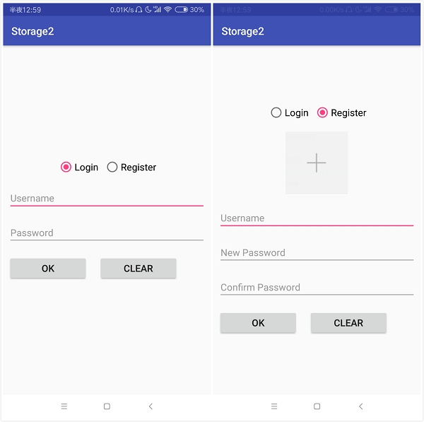
* 登录界面下，若Username为空,Password为空的情况如下：
 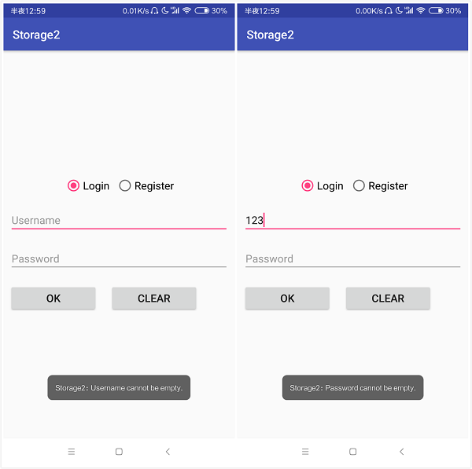
* 登录界面下，若Username不存在，密码错误的情况如下：
 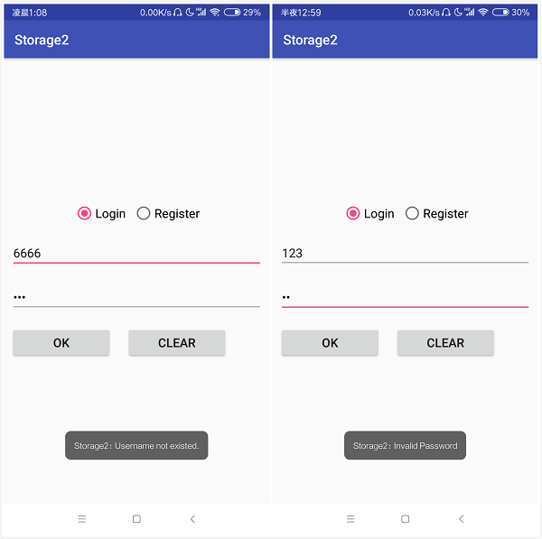
* 注册页面下，Username为空，New Password为空的情况如下：
 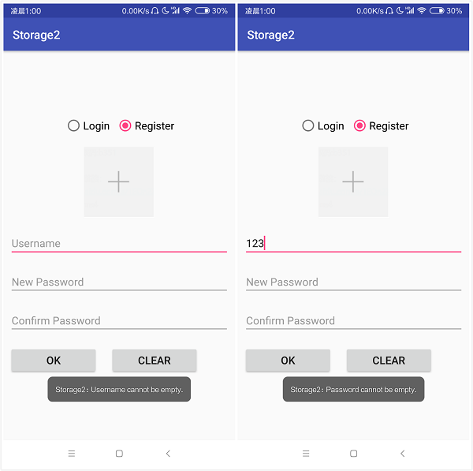
* 注册页面下，密码不匹配，Username已存在的情况如下：
 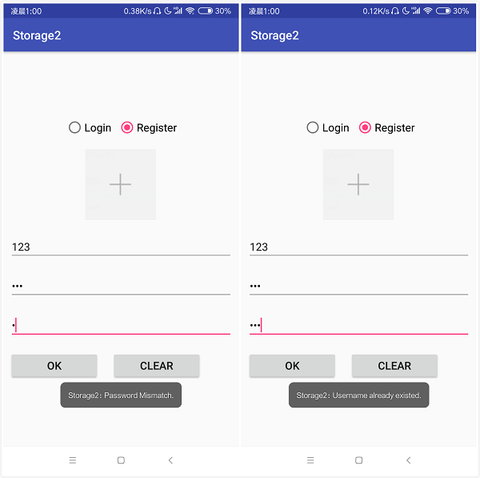
* 注册页面下，注册成功情况如下：
 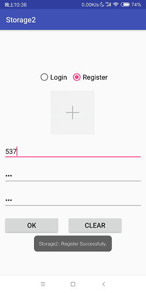
* 登录成功，页面跳转，弹出提示框，情况如下：
 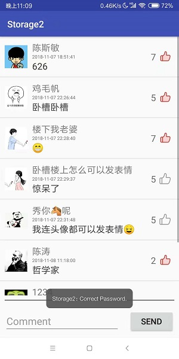
* 评论页面下，评论为空的情况点击发送按钮：
 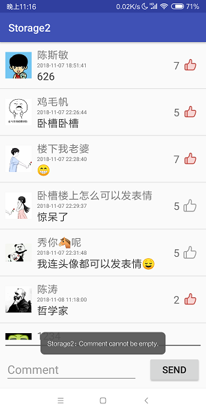
* 评论页面下，短按评论：弹出对话框，显示该评论的用户以及通讯录中该用户的电话号码（存在与否）：
 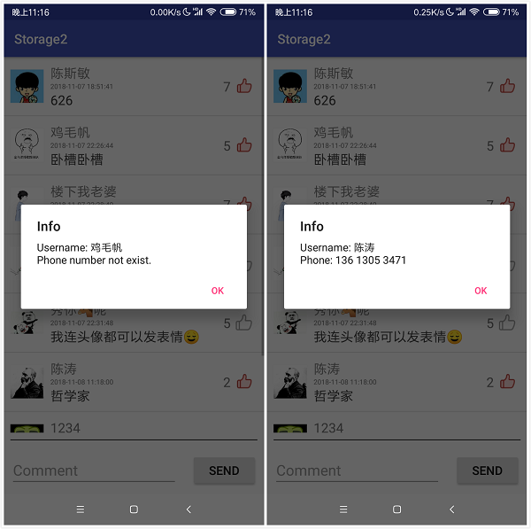
* 评论页面下，长按评论，如果是自己的账号的评论，删除和删除成功的情况：
 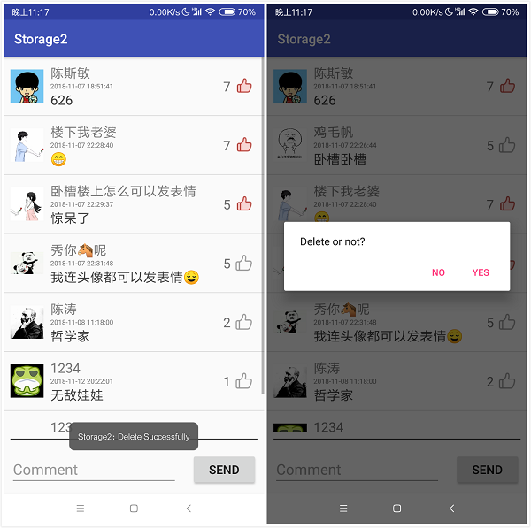
* 评论页面下，长按评论，如果不是自己的账号的评论，删除和删除成功的情况：
 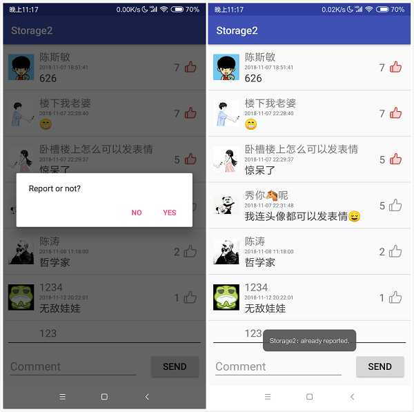
* 进入手机图库进行图片选择，ImageView显示本次选择的图片
 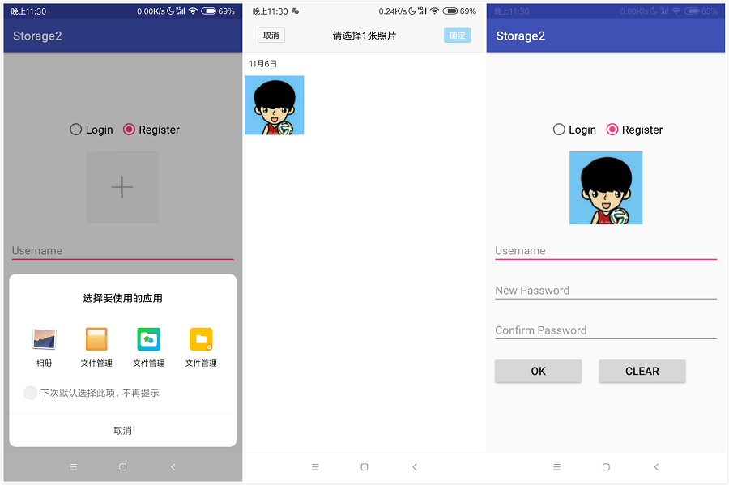

### (2) 实验步骤以及关键代码
* 首先是文件目录结构，我的文件目录结构如下（与tourial.md中所显示的文件结构目录类似）
  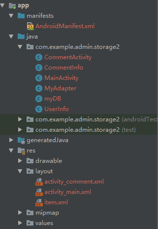
* 实现主页面（登录注册界面）的页面布局文件 activity_main.xml，该页面由约束布局实现，其中为了保持界面始终居中，还对总体套了一个相对布局，再让相对布局处于约束布局的中间。activity_main.xml 的缩略版本(忽略实现细节的版本，只显示元素及大体布局)如下：
    ```xml
    <android.support.constraint.ConstraintLayout>

    <!--这里给出如何实现相对布局位于约束布局居中的实现-->
    <RelativeLayout
        android:layout_width="match_parent"
        android:layout_height="wrap_content"
        app:layout_constraintBottom_toBottomOf="parent"
        app:layout_constraintEnd_toEndOf="parent"
        app:layout_constraintStart_toStartOf="parent"
        app:layout_constraintTop_toTopOf="parent">

            <RadioGroup android:id="@+id/radio_group">
                <RadioButton android:id="@+id/login"/>
                <RadioButton android:text="Register"/>
            </RadioGroup>

            <ImageView android:id="@+id/image"/>

            <LinearLayout>
                <EditText android:id="@+id/username"/>
                <EditText android:id="@+id/password"/>
                <EditText android:id="@+id/newPassword"/>
                <EditText android:id="@+id/confirmPassword"/>
            </LinearLayout>

            <Button android:id="@+id/OK"/>
            <Button android:id="@+id/CLEAR"/>

        </RelativeLayout>
    </android.support.constraint.ConstraintLayout>
    ```
* 接下来是UserInfo.java和CommentInfo.java两个类文件，这两个类主要是用于数据库插入时传递参数给数据库类myDB，myDB解析该类并将数据存入数据库中。
  UserInfo类成员（对类成员的get，set方法省略不显示）如下：
  ```java
  public class UserInfo {
    private int id;
    private String name;
    private String password;
    private Bitmap image;
    // 获取Bitmap图片的字节用以存入数据库
    public byte[] getImageByte() {
        ByteArrayOutputStream baos = new ByteArrayOutputStream();
        image.compress(Bitmap.CompressFormat.PNG, 100, baos);
        return baos.toByteArray();
    }
  }
  ```
  CommentInfo类成员（对类成员的get，set方法省略不显示）如下：
  ```java
  public class CommentInfo {
    private int comment_id;
    private String user_name;
    private String content;
    private String date;
    private int like_sum;
    private Bitmap user_image;
    // 表示当前该评论是否被登录用户所点赞（默认为false）
    private boolean islike = false;
  }
  ```
* 然后是数据库类myDB的实现，该类我采用单例模式实现，同时会操作三个数据库表——用户，评论以及用户点赞评论的关系表。
  单例模式的实现
  ```java
    // 单例模式
    private static myDB instance = null;
    public static myDB getInstance(Context context) {
        if(instance == null)
            instance = new myDB(context);
        return instance;
    }

    private static final int DB_VERSION = 1;

    // 构造函数设置为私有
    private myDB(Context context) {
        super(context, "database.db", null, DB_VERSION);
    }
  ```
  onCreate函数构建三个数据库表
  ```java
    private static final String USER_TABLE_NAME = "user";
    private static final String COMMENT_TABLE_NAME = "comment";
    private static final String LIKE_TABLE_NAME = "like_list";

    @Override
    public void onCreate(SQLiteDatabase sqLiteDatabase) {
        String CREATE_USER_TABLE = "CREATE TABLE if not exists "
                + USER_TABLE_NAME + " (" +
                "user_id INTEGER PRIMARY KEY AUTOINCREMENT, " +
                "name TEXT, " +
                "password TEXT, " +
                "image BLOB )";
        String CREATE_COMMENT_TABLE = "CREATE TABLE if not exists "
                + COMMENT_TABLE_NAME + " (" +
                "comment_id INTEGER PRIMARY KEY AUTOINCREMENT, " +
                "username TEXT, " +
                "content TEXT, " +
                "date TEXT, " +
                "like_sum INTEGER )";
        String CREARE_LIKE_TABLE = "CREATE TABLE if not exists "
                + LIKE_TABLE_NAME + " (" +
                "like_id INTEGER PRIMARY KEY AUTOINCREMENT, " +
                "username TEXT, " +
                "comment_id INTEGER )";
        sqLiteDatabase.execSQL(CREATE_USER_TABLE);
        sqLiteDatabase.execSQL(CREATE_COMMENT_TABLE);
        sqLiteDatabase.execSQL(CREARE_LIKE_TABLE);
    }
  ```
  对用户的插入和查询
  ```java
    // 插入用户
    public void insertUser(UserInfo data) {
        SQLiteDatabase db = getWritableDatabase();
        ContentValues cv = new ContentValues();
        cv.put("name", data.getName());
        cv.put("password", data.getPassword());
        cv.put("image", data.getImageByte());
        db.insert(USER_TABLE_NAME, null, cv);
        db.close();
    }

    // 根据名字获取用户信息
    public UserInfo getUserByName(String name) {
        SQLiteDatabase db = getWritableDatabase();
        String sql = String.format("SELECT * FROM %s WHERE name = '%s'",USER_TABLE_NAME, name );
        Cursor cursor = db.rawQuery( sql, null);
        if (!cursor.moveToFirst()) {
            cursor.close();
            return null;
        }
        else {
            UserInfo data = new UserInfo();
            data.setId(cursor.getInt(cursor.getColumnIndex("user_id")));
            data.setName(cursor.getString(cursor.getColumnIndex("name")));
            data.setPassword(cursor.getString(cursor.getColumnIndex("password")));
            data.setImageByByte(cursor.getBlob(cursor.getColumnIndex("image")));
            cursor.close();
            return data;
        }
    }

    // 判断该名字用户是否存在
    public Boolean queryUserByName(String name) {
        SQLiteDatabase db = getWritableDatabase();
        String sql = String.format("SELECT * FROM %s WHERE name = '%s'",USER_TABLE_NAME, name );
        Cursor cursor = db.rawQuery( sql, null);
        Boolean if_exist = cursor.moveToFirst();
        cursor.close();
        return if_exist;
    }

    // 根据用户名获取该用户的图片
    public Bitmap getUserImageByName(String username) {
        SQLiteDatabase db = getWritableDatabase();
        String sql = String.format("SELECT * FROM %s WHERE name = '%s'",USER_TABLE_NAME, username );
        Cursor cursor = db.rawQuery( sql, null);
        if (!cursor.moveToFirst()) {
            cursor.close();
            return null;
        }
        else {
            byte[] data = cursor.getBlob(cursor.getColumnIndex("image"));
            Bitmap image = BitmapFactory.decodeByteArray(data, 0, data.length);
            cursor.close();
            return image;
        }
    }
  ```
  对评论的插入和删除
  ```java
    // 插入评论
    public void insertComment(CommentInfo comment) {
        SQLiteDatabase db = getWritableDatabase();
        ContentValues cv = new ContentValues();
        cv.put("username", comment.getUserName());
        cv.put("content", comment.getContent());
        cv.put("date", comment.getDate());
        cv.put("like_sum", comment.getLikeSum());
        db.insert(COMMENT_TABLE_NAME, null, cv);
        db.close();
    }

    // 删除评论
    public void deleteComment(int comment_id) {
        SQLiteDatabase db = getWritableDatabase();
        String DELETE_COMMENT = "DELETE FROM " +
                COMMENT_TABLE_NAME +
                " WHERE comment_id = " + comment_id;
        db.execSQL(DELETE_COMMENT);
    }
  ```
  对点赞的插入和删除，需要同时修改Comment表中被点赞的评论的点赞数量
  ```java
    // 插入点赞
    public void insertLike(String username, int comment_id) {
        SQLiteDatabase db = getWritableDatabase();
        ContentValues cv = new ContentValues();
        cv.put("username", username);
        cv.put("comment_id", comment_id);
        db.insert(LIKE_TABLE_NAME, null, cv);
        String UPDATE_COMMENT = String.format(
                Locale.CHINA,"UPDATE %s SET like_sum = like_sum + 1 WHERE comment_id = %d ",
                COMMENT_TABLE_NAME, comment_id
        );
        db.execSQL(UPDATE_COMMENT);
        db.close();
    }

    // 删除点赞
    public void deleteLike(String username, int comment_id) {
        SQLiteDatabase db = getWritableDatabase();
        String  DELETE_LIKE = String.format(
                Locale.CHINA,"DELETE FROM %s WHERE username = '%s' and comment_id = %d",
                LIKE_TABLE_NAME , username, comment_id
        );
        String UPDATE_COMMENT = String.format(
                Locale.CHINA,"UPDATE %s SET like_sum = like_sum - 1 where comment_id = %d ",
                COMMENT_TABLE_NAME, comment_id
        );
        db.execSQL(DELETE_LIKE);
        db.execSQL(UPDATE_COMMENT);
        db.close();
    }
  ```
  对评论的查询，因为该项目运行时对评论的查询都是一次全部获取，所以直接实现一个返回List的函数。
  ```java
    // 获取所有的评论列表，参数用户名用于确定哪些评论被该用户点赞了
    public List<CommentInfo> getCommentList(String username) {
        SQLiteDatabase db = getWritableDatabase();
        List<CommentInfo> list = new ArrayList<>();
        String sql = String.format("SELECT * FROM %s", COMMENT_TABLE_NAME);
        Cursor cursor = db.rawQuery(sql, null);
        while (cursor.moveToNext()) {
            CommentInfo comment = new CommentInfo();
            comment.setCommentId(cursor.getInt(cursor.getColumnIndex("comment_id")));
            comment.setUserName(cursor.getString(cursor.getColumnIndex("username")));
            comment.setDate(cursor.getString(cursor.getColumnIndex("date")));
            comment.setLikeSum(cursor.getInt(cursor.getColumnIndex("like_sum")));
            comment.setContent(cursor.getString(cursor.getColumnIndex("content")));
            comment.setUserImage(getUserImageByName(comment.getUserName()));
            String sql2 = String.format(
                    Locale.CHINA, "SELECT * FROM %s WHERE username = '%s' and comment_id = %d",
                    LIKE_TABLE_NAME, username, comment.getCommentId());
            Cursor cursor2 = db.rawQuery(sql2, null);
            comment.setIsLike(cursor2.moveToFirst());
            cursor2.close();
            list.add(comment);
        }
        cursor.close();
        return list;
    }
  ```
* 然后是登录和注册页面代码的实现，这个与上周作业比较相似，下面会主要分析一下对数据库的调用和压缩图片的实现。
  onCreate函数中获取数据库的单例，bitmap用于保存被压缩的图片
  ```java
    private Bitmap bitmap = null;
    private myDB database;
    @Override
    protected void onCreate(Bundle savedInstanceState) {
        super.onCreate(savedInstanceState);
        setContentView(R.layout.activity_main);
        setRadioCheckedChanged();
        database = myDB.getInstance(this);
    }
  ```
  点击OK按钮函数，根据当前是登录页面还是注册页面有不同的事件处理，会对数据库进行查询和插入。
  ```java
    public void OKButtonOnClick(View target) {
        if (findViewById(R.id.password).getVisibility() == View.VISIBLE) {
            // Login状态
            String username = ((EditText)findViewById(R.id.username)).getText().toString();
            if (username.equals("")) {
                Toast.makeText(this, "Username cannot be empty.", Toast.LENGTH_SHORT).show();
                return;
            }
            String password = ((EditText)findViewById(R.id.password)).getText().toString();
            if (password.equals("")) {
                Toast.makeText(this, "Password cannot be empty.", Toast.LENGTH_SHORT).show();
                return;
            }
            if (!database.queryUserByName(username)) {
                Toast.makeText(this, "Username not existed.", Toast.LENGTH_SHORT).show();
                return;
            }
            UserInfo data = database.getUserByName(username);
            if (!data.getPassword().equals(password)){
                Toast.makeText(this, "Invalid Password", Toast.LENGTH_SHORT).show();
                return;
            }
            Toast.makeText(this, "Correct Password.", Toast.LENGTH_SHORT).show();

            Intent intent = new Intent(MainActivity.this, CommentActivity.class);
            Bundle bundle = new Bundle();
            bundle.putString("username", username);
            intent.putExtras(bundle);
            startActivity(intent);

        } else {
            // Registes状态
            String username = ((EditText)findViewById(R.id.username)).getText().toString();
            if (username.equals("")) {
                Toast.makeText(this, "Username cannot be empty.", Toast.LENGTH_SHORT).show();
                return;
            }
            String newPassword = ((EditText)findViewById(R.id.newPassword)).getText().toString();
            if (newPassword.equals("")) {
                Toast.makeText(this, "Password cannot be empty.", Toast.LENGTH_SHORT).show();
                return;
            }
            String confirmPassword = ((EditText)findViewById(R.id.confirmPassword)).getText().toString();
            if (!confirmPassword.equals(newPassword)) {
                Toast.makeText(this, "Password Mismatch.", Toast.LENGTH_SHORT).show();
                return;
            }
            if (database.queryUserByName(username)) {
                Toast.makeText(this, "Username already existed.", Toast.LENGTH_SHORT).show();
                return;
            }
            if (bitmap == null) {
                bitmap = BitmapFactory.decodeResource(getResources(), R.mipmap.me);
            }
            UserInfo data = new UserInfo();
            data.setName(username);
            data.setPassword(newPassword);
            data.setImage(bitmap);
            database.insertUser(data);

            // 注册成功不进行跳转，弹出toast提示
            Toast.makeText(this, "Register Successfully.", Toast.LENGTH_SHORT).show();
        }
    }
  ```
  点击ImageView会进行图片选择，此时会涉及权限的获取
  ```java
    public void ImageViewOnClick(View target) {
        if(ContextCompat.checkSelfPermission(MainActivity.this,
                Manifest.permission.WRITE_EXTERNAL_STORAGE) == PackageManager.PERMISSION_GRANTED){
            //如果有权限直接执行
            LoadImage();
        } else{
            //如果没有权限那么申请权限
            ActivityCompat.requestPermissions(MainActivity.this,
                    new String[]{Manifest.permission.WRITE_EXTERNAL_STORAGE},0);
        }
    }
  ```
  接下来是对加载图片，图片压缩的实现，分为下面几个函数
  ```java
    void LoadImage() {
        Intent intent = new Intent();
        intent.setAction(Intent.ACTION_PICK);
        intent.setType("image/*");
        startActivityForResult(intent, 0);
    }

    @Override
    protected void onActivityResult(int requestCode, int resultCode, Intent data) {
        if (data != null) {
            // 得到图片的全路径
            Uri uri = data.getData();
            try {
                // 通过路径加载图片
                // 同时图片缩放操作，如果图片过大，可能会导致内存泄漏
                bitmap = getBitmapFormUri(uri);
                ImageView iv_image = findViewById(R.id.image);
                iv_image.setImageBitmap(bitmap);
            } catch (Exception e) {
                Toast.makeText(this, "图片读取错误", Toast.LENGTH_SHORT).show();
            }
        }
        super.onActivityResult(requestCode, resultCode, data);
    }

    @Override
    public void onRequestPermissionsResult(int requestCode, @NonNull String[] permissions, @NonNull int[] grantResults) {
        if(requestCode == 0){
            if(grantResults[0] == PackageManager.PERMISSION_GRANTED){
                LoadImage();
            }else{
                Toast.makeText(this, "您已经拒绝读取照片的权限", Toast.LENGTH_SHORT).show();
            }
        }
        super.onRequestPermissionsResult(requestCode,permissions,grantResults);
    }

    public Bitmap getBitmapFormUri(Uri uri) throws FileNotFoundException, IOException {
        InputStream input = this.getContentResolver().openInputStream(uri);
        BitmapFactory.Options onlyBoundsOptions = new BitmapFactory.Options();
        onlyBoundsOptions.inJustDecodeBounds = true;
        onlyBoundsOptions.inDither = true;
        onlyBoundsOptions.inPreferredConfig = Bitmap.Config.ARGB_8888;
        BitmapFactory.decodeStream(input, null, onlyBoundsOptions);
        input.close();
        int originalWidth = onlyBoundsOptions.outWidth;
        int originalHeight = onlyBoundsOptions.outHeight;
        if ((originalWidth == -1) || (originalHeight == -1))
            return null;
        //图片分辨率以120x120为标准
        float hh = 120f;  //这里设置高度为120f
        float ww = 120f;  //这里设置宽度为120f
        //缩放比。由于是固定比例缩放，只用高或者宽其中一个数据进行计算即可
        int be = 1;  //be=1表示不缩放
        if (originalWidth > originalHeight && originalWidth > ww) {
            //如果宽度大的话根据宽度固定大小缩放
            be = (int) (originalWidth / ww);
        } else if (originalWidth < originalHeight && originalHeight > hh) {
            //如果高度高的话根据宽度固定大小缩放
            be = (int) (originalHeight / hh);
        }
        if (be <= 0)
            be = 1;
        //比例压缩
        BitmapFactory.Options bitmapOptions = new BitmapFactory.Options();
        bitmapOptions.inSampleSize = be;//设置缩放比例
        bitmapOptions.inDither = true;//optional
        bitmapOptions.inPreferredConfig = Bitmap.Config.ARGB_8888;//optional
        input = this.getContentResolver().openInputStream(uri);
        Bitmap bitmap = BitmapFactory.decodeStream(input, null, bitmapOptions);
        input.close();

        return compressImage(bitmap);//再进行质量压缩
    }

    public static Bitmap compressImage(Bitmap image) {

        ByteArrayOutputStream baos = new ByteArrayOutputStream();
        image.compress(Bitmap.CompressFormat.JPEG, 100, baos);//质量压缩方法，这里100表示不压缩，把压缩后的数据存放到baos中
        int options = 100;
        while (baos.toByteArray().length / 1024 > 100) {  //循环判断如果压缩后图片是否大于100kb,大于继续压缩
            baos.reset();//重置baos即清空baos
            //第一个参数 ：图片格式 ，第二个参数： 图片质量，100为最高，0为最差  ，第三个参数：保存压缩后的数据的流
            image.compress(Bitmap.CompressFormat.JPEG, options, baos);//这里压缩options%，把压缩后的数据存放到baos中
            options -= 10;//每次都减少10
        }
        ByteArrayInputStream isBm = new ByteArrayInputStream(baos.toByteArray());//把压缩后的数据baos存放到ByteArrayInputStream中
        Bitmap bitmap = BitmapFactory.decodeStream(isBm, null, null);//把ByteArrayInputStream数据生成图片
        return bitmap;
    }
  ```
* 然后是item.xml的实现，该布局文件用以评论页面中ListView的单个item的承载，我这里使用相对布局实现，粗略版本如下（忽略细节实现，详情见code）：
  ```xml
  <RelativeLayout>

    <ImageView android:id="@+id/user_image" />

    <LinearLayout android:id="@+id/linearLayout">
        <TextView android:id="@+id/username" />
        <TextView android:id="@+id/date" />
        <TextView android:id="@+id/content" />
    </LinearLayout>

    <TextView android:id="@+id/like_sum" />
    <ImageView android:id="@+id/like_image" />

  </RelativeLayout>
  ```
* 然后是其适配器MyAdapter的实现，主要是getView函数的实现，需要封装好点赞的细节显示和调用数据库操作：
  ```java
    private class ViewHolder {
        public TextView userName;
        public TextView date;
        public TextView content;
        public TextView likeSum;
        public ImageView userImage;
        public ImageView likeImage;
    }

        @Override
    public View getView(final int i, View view, ViewGroup viewGroup) {
        // 新声明一个View变量和ViewHoleder变量,ViewHolder类在下面定义。
        View convertView ;
        ViewHolder viewHolder;
        // 当view为空时才加载布局，否则，直接修改内容
        if (view == null) {
            // 通过inflate的方法加载布局，context需要在使用这个Adapter的Activity中传入。
            view = LayoutInflater.from(context).inflate(R.layout.item, null);
            viewHolder = new ViewHolder();
            viewHolder.userName = view.findViewById(R.id.username);
            viewHolder.date = view.findViewById(R.id.date);
            viewHolder.content = view.findViewById(R.id.content);
            viewHolder.likeSum = view.findViewById(R.id.like_sum);
            viewHolder.likeImage = view.findViewById(R.id.like_image);
            viewHolder.userImage = view.findViewById(R.id.user_image);
            view.setTag(viewHolder); // 用setTag方法将处理好的viewHolder放入view中
            convertView = view;
        } else { // 否则，让convertView等于view，然后从中取出ViewHolder即可
            convertView = view;
            viewHolder = (ViewHolder) convertView.getTag();
        }
        final  CommentInfo comment = list.get(i);
        // 从viewHolder中取出对应的对象，然后赋值给他们
        viewHolder.userName.setText(comment.getUserName());
        viewHolder.date.setText(comment.getDate());
        viewHolder.likeSum.setText(""+comment.getLikeSum());
        viewHolder.content.setText(comment.getContent());
        viewHolder.userImage.setImageBitmap(comment.getUserImage());
        if (comment.getIsLike())
            viewHolder.likeImage.setImageResource(R.mipmap.red);
        else
            viewHolder.likeImage.setImageResource(R.mipmap.white);

        // 点赞按钮点击事件
        viewHolder.likeImage.setOnClickListener(new View.OnClickListener() {
            @Override
            public void onClick(View v) {
                ImageView im = (ImageView) v;
                comment.setIsLike(!comment.getIsLike());
                if (comment.getIsLike()) {
                    im.setImageResource(R.mipmap.red);
                    comment.setLikeSum(comment.getLikeSum()+1);
                    myDB.getInstance(null).insertLike(user.getName(), comment.getCommentId());
                    notifyDataSetChanged();
                }
                else {
                    im.setImageResource(R.mipmap.white);
                    comment.setLikeSum(comment.getLikeSum()-1);
                    myDB.getInstance(null).deleteLike(user.getName(), comment.getCommentId());
                    notifyDataSetChanged();
                }
            }
        });

        // 将这个处理好的view返回
        return convertView;
    }
  ```
* 评论页面布局文件activity_comment.xml的实现如下，主要是一个ListView和下方的实现，下方使用线性布局把编辑框和按钮包装起来：
  ```xml
  <LinearLayout xmlns:android="http://schemas.android.com/apk/res/android"
    android:layout_width="match_parent"
    android:layout_height="match_parent"
    android:orientation="vertical">

    <ListView
        android:id="@+id/list_view"
        android:layout_weight="1"
        android:layout_width="match_parent"
        android:layout_height="0dp"/>
    <View
        android:layout_width="match_parent"
        android:layout_height="1dp"
        android:layout_margin="10dp"
        android:background="#000000"/>
    <LinearLayout
        android:layout_width="match_parent"
        android:layout_height="wrap_content">
        <EditText
            android:id="@+id/edit_text"
            android:hint="Comment"
            android:layout_gravity="center_vertical"
            android:textSize="22sp"
            android:layout_width="0dp"
            android:layout_weight="1"
            android:layout_height="50dp"
            android:layout_margin="10dp"/>
        <Button
            android:text="SEND"
            android:textSize="18sp"
            android:layout_gravity="center_vertical"
            android:onClick="SendButtonOnClick"
            android:layout_width="100dp"
            android:layout_height="50dp"
            android:layout_margin="10dp"/>
    </LinearLayout>

  </LinearLayout>
  ```
* 然后是CommentActivity.java的实现。
  onCreate函数接收来自MainActivity.java传来的用户名，根据用户名获取该用户的其他信息以及评论列表。
  ```java
    private myDB database;
    private UserInfo user;
    private  List<CommentInfo> commentList = new ArrayList<>();
    final MyAdapter myListViewAdapter = new MyAdapter(CommentActivity.this, commentList);

    @Override
    protected void onCreate(Bundle savedInstanceState) {
        super.onCreate(savedInstanceState);
        setContentView(R.layout.activity_comment);
        database = myDB.getInstance(this);
        // 接收数据，解析获取用户名
        Bundle bundle = getIntent().getExtras();
        user = database.getUserByName(bundle.getString("username"));
        commentList = database.getCommentList(user.getName());
        Init();
    }
  ```
  Inin函数是对设配器myListViewAdapter的初始化，需要设置item的点击和长按事件，点击事件需要获取通信录（涉及通信录权限的获取）：
  ```java
    private void Init() {
        final ListView listView = findViewById(R.id.list_view);
        myListViewAdapter.setUser(user);
        listView.setAdapter(myListViewAdapter);

        listView.setOnItemClickListener(new AdapterView.OnItemClickListener() {
            @Override
            public void onItemClick(AdapterView<?> adapterView, View view, int i, long l) {
                // 处理单击事件
                // 获取电话号码
                if(ContextCompat.checkSelfPermission(CommentActivity.this,
                        Manifest.permission.READ_CONTACTS) != PackageManager.PERMISSION_GRANTED){
                    //如果没有权限那么申请权限
                    final AlertDialog.Builder dialog2 = new AlertDialog.Builder(CommentActivity.this);
                    dialog2.setMessage("是否给予应用读取联系人权限?");
                    dialog2.setPositiveButton("YES", new DialogInterface.OnClickListener() {
                        @Override
                        public void onClick(DialogInterface dialog, int which) {
                            Intent intent = new Intent(Settings.ACTION_APPLICATION_DETAILS_SETTINGS);
                            // 根据包名打开对应的设置界面
                            intent.setData(Uri.parse("package:" + getPackageName()));
                            startActivity(intent);
                        }
                    });
                    dialog2.setNegativeButton("NO", new DialogInterface.OnClickListener() {
                        @Override
                        public void onClick(DialogInterface dialog, int which) {
                            Toast.makeText(CommentActivity.this, "您已经拒绝读取通信录的权限", Toast.LENGTH_SHORT).show();
                        }
                    });
                    dialog2.show();
                    return;
                }
                final AlertDialog.Builder dialog = new AlertDialog.Builder(CommentActivity.this);
                String username = ((TextView)view.findViewById(R.id.username)).getText().toString();
                String message = "Username: " + username;
                try {
                    Cursor cursor = getContentResolver().query(ContactsContract.CommonDataKinds.Phone.CONTENT_URI, null, ContactsContract.CommonDataKinds.Phone.DISPLAY_NAME + " = \"" + username + "\"", null, null);
                    if (cursor.moveToFirst())
                        message += "\nPhone: " + cursor.getString(cursor.getColumnIndex(ContactsContract.CommonDataKinds.Phone.NUMBER));
                    else
                        message += "\nPhone number not exist.";
                    cursor.close();
                } catch (Exception e){
                    message += "\nNo Permission To Get Phone Number.";
                }
                dialog.setTitle("Info").setMessage(message);
                dialog.setPositiveButton("OK", null);
                dialog.create().show();
            }
        });

        listView.setOnItemLongClickListener(new AdapterView.OnItemLongClickListener() {
            @Override
            public boolean onItemLongClick(AdapterView<?> adapterView, View view, final int position, long l) {
                // 处理长按事件
                final CommentInfo comment = commentList.get(position);
                if (comment.getUserName().equals(user.getName())) {
                    final AlertDialog.Builder dialog = new AlertDialog.Builder(CommentActivity.this);
                    dialog.setMessage("Delete or not?");
                    dialog.setPositiveButton("YES", new DialogInterface.OnClickListener() {
                        @Override
                        public void onClick(DialogInterface dialog, int which) {
                            database.deleteComment(comment.getCommentId());
                            myListViewAdapter.removeItem(position);
                            Toast.makeText(CommentActivity.this, "Delete Successfully", Toast.LENGTH_SHORT).show();
                        }
                    });
                    dialog.setNegativeButton("NO", null);
                    dialog.create().show();
                } else {
                    final AlertDialog.Builder dialog = new AlertDialog.Builder(CommentActivity.this);
                    dialog.setMessage("Report or not?");
                    dialog.setPositiveButton("YES", new DialogInterface.OnClickListener() {
                        @Override
                        public void onClick(DialogInterface dialog, int which) {
                            Toast.makeText(CommentActivity.this, "already reported.", Toast.LENGTH_SHORT).show();
                        }
                    });
                    dialog.setNegativeButton("NO", null);
                    dialog.create().show();
                }
                return true;
            }
        });
        myListViewAdapter.refreshList(commentList);
    }

    @Override
    public void onRequestPermissionsResult(int requestCode, @NonNull String[] permissions, @NonNull int[] grantResults) {
        if(requestCode == 1){
            if(grantResults[0] == PackageManager.PERMISSION_GRANTED){
                Toast.makeText(this, "授权成功", Toast.LENGTH_SHORT).show();
            }else{
                Toast.makeText(this, "您已经拒绝读取通信录的权限", Toast.LENGTH_SHORT).show();
            }
        }
        super.onRequestPermissionsResult(requestCode,permissions,grantResults);
    }
  ```
  Send按钮点击函数的实现比较简单，操作数据库，更新适配器：
  ```java
    public void SendButtonOnClick(View target) {
        String content = ((EditText)findViewById(R.id.edit_text)).getText().toString();
        if (content.equals("")) {
            Toast.makeText(this, "Comment cannot be empty.", Toast.LENGTH_SHORT).show();
            return;
        }
        SimpleDateFormat formatter = new SimpleDateFormat("yyyy-MM-dd HH:mm:ss");
        String date = formatter.format(new Date());
        CommentInfo comment = new CommentInfo();
        comment.setUserName(user.getName());
        comment.setContent(content);
        comment.setDate(date);
        comment.setLikeSum(0);
        database.insertComment(comment);

        commentList = database.getCommentList(user.getName());
        myListViewAdapter.refreshList(commentList);
    }
  ```

### (3) 附加内容实现及数据库表实现的说明：
* **重要的数据库SQL语句**
  ```java
    // 创建语句如下：
    String CREATE_USER_TABLE = "CREATE TABLE if not exists "
        + USER_TABLE_NAME + " (" +
        "user_id INTEGER PRIMARY KEY AUTOINCREMENT, " +
        "name TEXT, " +
        "password TEXT, " +
        "image BLOB )";
    String CREATE_COMMENT_TABLE = "CREATE TABLE if not exists "
        + COMMENT_TABLE_NAME + " (" +
        "comment_id INTEGER PRIMARY KEY AUTOINCREMENT, " +
        "username TEXT, " +
        "content TEXT, " +
        "date TEXT, " +
        "like_sum INTEGER )";
    String CREARE_LIKE_TABLE = "CREATE TABLE if not exists "
        + LIKE_TABLE_NAME + " (" +
        "like_id INTEGER PRIMARY KEY AUTOINCREMENT, " +
        "username TEXT, " +
        "comment_id INTEGER )";
    
    // 用户查询语句如下：
    String sql = String.format("SELECT * FROM %s WHERE name = '%s'",USER_TABLE_NAME, name );
    // 插入用户语句如下（非SQL语句实现）：
    SQLiteDatabase db = getWritableDatabase();
    ContentValues cv = new ContentValues();
    cv.put("name", data.getName());
    cv.put("password", data.getPassword());
    cv.put("image", data.getImageByte());
    db.insert(USER_TABLE_NAME, null, cv);
    db.close();

    // 获取所有评论语句如下：
    String sql = String.format("SELECT * FROM %s", COMMENT_TABLE_NAME);
    // 插入评论如下（非SQL语句实现）：
    SQLiteDatabase db = getWritableDatabase();
    ContentValues cv = new ContentValues();
    cv.put("username", comment.getUserName());
    cv.put("content", comment.getContent());
    cv.put("date", comment.getDate());
    cv.put("like_sum", comment.getLikeSum());
    db.insert(COMMENT_TABLE_NAME, null, cv);
    db.close();
    // 删除评论语句如下：
    String DELETE_COMMENT = "DELETE FROM " + COMMENT_TABLE_NAME + " WHERE comment_id = " + comment_id;

    // 插入点赞同时update被点赞评论的点赞数
    SQLiteDatabase db = getWritableDatabase();
    ContentValues cv = new ContentValues();
    cv.put("username", username);
    cv.put("comment_id", comment_id);
    db.insert(LIKE_TABLE_NAME, null, cv);
    String UPDATE_COMMENT = String.format(
        Locale.CHINA,"UPDATE %s SET like_sum = like_sum + 1 WHERE comment_id = %d ",
        COMMENT_TABLE_NAME, comment_id
    );
    db.execSQL(UPDATE_COMMENT);
    db.close();
    // 删除点赞同时update被取消评论的点赞数的SQL语句
    String  DELETE_LIKE = String.format(
        Locale.CHINA,"DELETE FROM %s WHERE username = '%s' and comment_id = %d",
        LIKE_TABLE_NAME , username, comment_id
    );
    String UPDATE_COMMENT = String.format(
        Locale.CHINA,"UPDATE %s SET like_sum = like_sum - 1 where comment_id = %d ",
        COMMENT_TABLE_NAME, comment_id
    );

  ```
* **如何使用数据库存用户头像**
  登录注册页面将该获取该图片放置在bitmap变量中
  ```java
    @Override
    protected void onActivityResult(int requestCode, int resultCode, Intent data) {
        if (data != null) {
            // 得到图片的全路径
            Uri uri = data.getData();
            try {
                // 通过路径加载图片
                // 同时图片缩放操作，如果图片过大，可能会导致内存泄漏
                bitmap = getBitmapFormUri(uri);
                ImageView iv_image = findViewById(R.id.image);
                iv_image.setImageBitmap(bitmap);
            } catch (Exception e) {
                Toast.makeText(this, "图片读取错误", Toast.LENGTH_SHORT).show();
            }
        }
        super.onActivityResult(requestCode, resultCode, data);
    }
  ```
  这里将获取到的图片头像在UserInfo中以bitmap形式存在，同时，我又实现了将bitmap转化为byte数组的函数和将byte数组转化为bitmap的函数，以方便转化：
  ```java
    public byte[] getImageByte() {
        ByteArrayOutputStream baos = new ByteArrayOutputStream();
        image.compress(Bitmap.CompressFormat.PNG, 100, baos);
        return baos.toByteArray();
    }
    public void setImageByByte(byte[] data) {
        image = BitmapFactory.decodeByteArray(data, 0, data.length);
    }
  ```
  然后，在数据库中，以BLOB的形式定义image
  ```java
    String CREATE_USER_TABLE = "CREATE TABLE if not exists "
        + USER_TABLE_NAME + " (" +
        "user_id INTEGER PRIMARY KEY AUTOINCREMENT, " +
        "name TEXT, " +
        "password TEXT, " +
        "image BLOB )";
  ```
  插入数据库时，调用上面的getImageByte()函数，将图片转为byte之后存入数据库中：
  ```java
    cv.put("image", data.getImageByte());
  ```
  从数据库中获取数据时，得到的是byte[]，将其用上面的setImageByByte函数转为bitmap之后保存在该UserInfo对象中:
  ```java
    data.setImageByByte(cursor.getBlob(cursor.getColumnIndex("image")));
  ```
* **如何设计评论与用户之间点赞关系的关联表。**
  这里，我们创建了一个新的表like_list，用以存储点赞，该表中每一个条目包含来自用户表的username和来自评论表的comment_id，这两个属性都能唯一地标识一个用户或标识一个评论，每个条目用来表示该username对应的用户点赞了该comment_id对应的评论，那么，当用户点赞时，便往该表中插入这样一个条目。当用户取消点赞时，便根据username和comment_id从该表中删除对应条目。同时插入或者删除对应的点赞时，要更新对应评论的点赞数量。
  ```java
    // 该表的创建SQL语句
    String CREARE_LIKE_TABLE = "CREATE TABLE if not exists "
        + LIKE_TABLE_NAME + " (" +
        "like_id INTEGER PRIMARY KEY AUTOINCREMENT, " +
        "username TEXT, " +
        "comment_id INTEGER )";
    
        // 插入点赞
    public void insertLike(String username, int comment_id) {
        SQLiteDatabase db = getWritableDatabase();
        ContentValues cv = new ContentValues();
        cv.put("username", username);
        cv.put("comment_id", comment_id);
        db.insert(LIKE_TABLE_NAME, null, cv);
        String UPDATE_COMMENT = String.format(
                Locale.CHINA,"UPDATE %s SET like_sum = like_sum + 1 WHERE comment_id = %d ",
                COMMENT_TABLE_NAME, comment_id
        );
        db.execSQL(UPDATE_COMMENT);
        db.close();
    }

    // 删除点赞
    public void deleteLike(String username, int comment_id) {
        SQLiteDatabase db = getWritableDatabase();
        String  DELETE_LIKE = String.format(
                Locale.CHINA,"DELETE FROM %s WHERE username = '%s' and comment_id = %d",
                LIKE_TABLE_NAME , username, comment_id
        );
        String UPDATE_COMMENT = String.format(
                Locale.CHINA,"UPDATE %s SET like_sum = like_sum - 1 where comment_id = %d ",
                COMMENT_TABLE_NAME, comment_id
        );
        db.execSQL(DELETE_LIKE);
        db.execSQL(UPDATE_COMMENT);
        db.close();
    }
  ```
* **如何实现“点赞”的点击事件，以及点赞状态和点赞数是如何获取的。**
  首先是点赞状态的实现，我在这里为CommentInfo对象设置了一个isLike的布尔属性，标识该评论是否已经被当前用户所点赞，那么这个属性的初始化就需要在获取评论列表时，根据用户名，对每一个评论，从上面我们提及的like_list数据库关系表中查询是否有该<username，comment_id>条目，来得知是否被点赞过：
  ```java
    String sql2 = String.format(
        Locale.CHINA, "SELECT * FROM %s WHERE username = '%s' and comment_id = %d",
        LIKE_TABLE_NAME, username, comment.getCommentId());
    Cursor cursor2 = db.rawQuery(sql2, null);
    comment.setIsLike(cursor2.moveToFirst());
    cursor2.close();
  ```
  然后在适配器中，根据该isLike属性，设置点赞按钮的初始样式，点赞数则直接来自CommentInfo本身属性like_sum：
  ```java
    viewHolder.likeSum.setText(""+comment.getLikeSum());
    if (comment.getIsLike())
        viewHolder.likeImage.setImageResource(R.mipmap.red);
    else
        viewHolder.likeImage.setImageResource(R.mipmap.white);
  ```
  点赞按钮的点击事件也是根据isLike来判断当前的点赞状态，并作出相应的事件处理。
  ```java
    viewHolder.likeImage.setOnClickListener(new View.OnClickListener() {
        @Override
        public void onClick(View v) {
            ImageView im = (ImageView) v;
            // 点赞状态取非
            comment.setIsLike(!comment.getIsLike());
            if (comment.getIsLike()) {
                im.setImageResource(R.mipmap.red);
                comment.setLikeSum(comment.getLikeSum()+1);
                myDB.getInstance(null).insertLike(user.getName(), comment.getCommentId());
                notifyDataSetChanged();
            }
            else {
                im.setImageResource(R.mipmap.white);
                comment.setLikeSum(comment.getLikeSum()-1);
                myDB.getInstance(null).deleteLike(user.getName(), comment.getCommentId());
                notifyDataSetChanged();
            }
        }
    });
  ```


### (4) 实验遇到的困难以及解决思路
#### 问题一：如何实现在登录、注册界面始终居中显示
解决：总布局我使用的是约束布局，可以在子元素外围包一层布局（相对布局、线性布局都可以），然后，将这层布局设置在总布局的水平和垂直居，居中设置大体如下：
```xml
<android.support.constraint.ConstraintLayout >
    <RelativeLayout
        android:layout_width="match_parent"
        android:layout_height="wrap_content"
        app:layout_constraintBottom_toBottomOf="parent"
        app:layout_constraintEnd_toEndOf="parent"
        app:layout_constraintStart_toStartOf="parent"
        app:layout_constraintTop_toTopOf="parent">
    </RelativeLayout>
</android.support.constraint.ConstraintLayout>
```
#### 问题二：我是在MIUI上进行测试，在获取通信录权限时总是闪退。
解决：安卓23以上的版本需要自己在代码中获取权限，但是我获取权限后还是闪退，后来发现需要在manifest中设置下面属性：
```java
<uses-permission-sdk-23 android:name="android.permission.READ_CONTACTS"/>
```
---

## 五、实验思考及感想

#### 这周的任务较为复杂，相比上周任务需要完成的比较多且难，需要对数据库进行设计和操作，读取本地图片、通信录等，涉及权限的获取操作，同时界面的设计和完善也比较复杂，各种事件的点击的实现也较为繁琐，但总的来说也学到了很多有用的知识，难也能学有所成吧，通过完成这周的任务，我有以下收获：
#### 1. 学习SQLite数据库的使用，能够使用其进行增删改查等数据操作。
#### 2. 学习ContentProvider的使用，能够获取通信录的权限。
#### 3. 复习了Android界面编程，掌握了一些页面布局的技巧，如layout_weight的使用，各种布局的适用场景等。
#### 4. 复习事件处理基础和页面跳转的知识。
---
